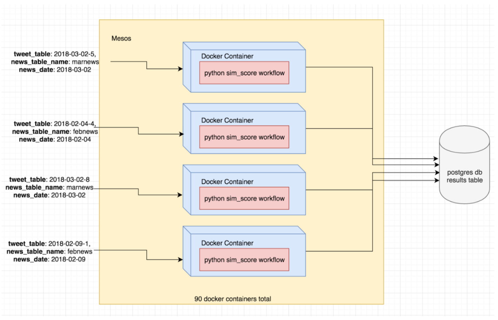
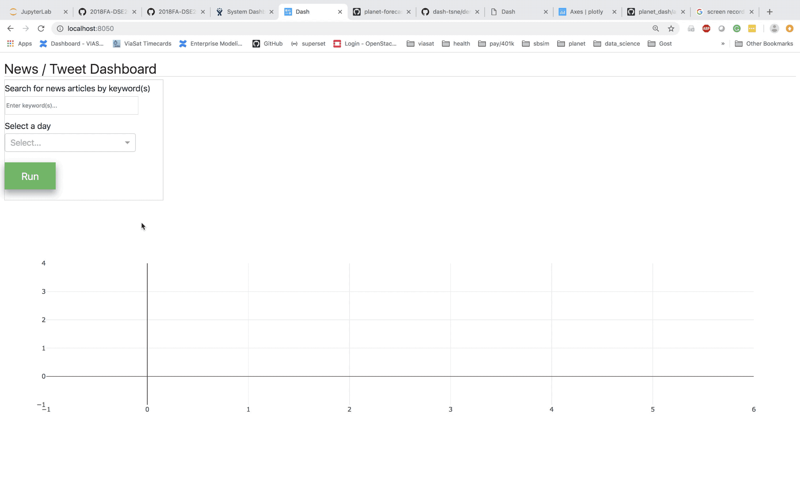

# news-tweets-nlp-link

Link tweets with news articles based on similarity of text content using NLP techniques. Use distributed computing to run similarity score pipeline on data in parallel for speedup boost (using mesos and docker).

## sim_score_distributed_pipeline

mesos and docker pipeline configuration for distributed computing

## dash_app

Live dashboard to view and interact with the resulting similarity scores of news vs tweets

